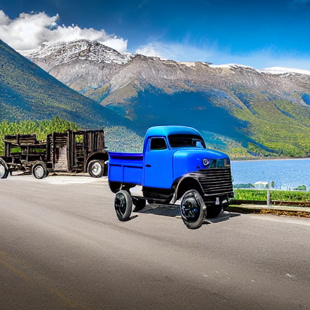

<div align="center">

# Re-implementation of ControlNet with Shape Masks

[[`Hugging Face`]](https://huggingface.co/AlonzoLeeeooo/shape-guided-controlnet) [[`Pre-Annotated Dataset`]](https://huggingface.co/datasets/AlonzoLeeeooo/COCO2014-train-u2net-masks)
</div>

<!-- omit in toc -->
# Table of Contents
- [<u>1. Overview</u>](#overview)
- [<u>2. To-Do List</u>](#to-do-list)
- [<u>3. Code Structure</u>](#code-structure)
- [<u>4. Implementation Details</u>](#implementation-details)
- [<u>5. Prerequisites</u>](#prerequisites)
- [<u>6. Training</u>](#training)
- [<u>7. Sampling</u>](#sampling)
- [<u>8. Results</u>](#results)
- [<u>9. Star History</u>](#star-history)

<!-- omit in toc -->
# Overview
This is a re-implementation of ControlNet trained with shape masks.
If you have any suggestions about this repo, please feel free to [start a new issue](https://github.com/AlonzoLeeeooo/shape-guided-controlnet/issues/new) or [propose a PR](https://github.com/AlonzoLeeeooo/shape-guided-controlnet/pulls).

[<u><small><🎯Back to Table of Contents></small></u>](#table-of-contents)


<!-- omit in toc -->
# To-Do List
- [ ] Update `install.sh`
- [x] Update the pre-annotated masks of COCO 2014 training set
- Regular Maintainence

[<u><small><🎯Back to Table of Contents></small></u>](#table-of-contents)


<!-- omit in toc -->
# Code Structure
```
shape-guided-controlnet
├── LICENSE
├── README.md
├── annotators                       <----- Code of annotators for shape masks
│   └── u2net_saliency_detection
├── dataset_loaders                  <----- Code of dataset loaders
├── examples                         <----- Example conditions for validation use
│   └── conditions
├── inference.py                     <----- Script to inference trained ControlNet model
├── runners                          <----- Source code of training and inference runners
│   ├── controlnet_inference_runner.py
│   └── controlnet_train_runner.py
├── train.py                         <----- Script to train ControlNet model
└── utils                            <----- Code of toolkit functions
```

[<u><small><🎯Back to Table of Contents></small></u>](#table-of-contents)


<!-- omit in toc -->
# Implementation Details
The ControlNet model is trained on COCO 2014 dataset with 100,000 iterations, along with a batch size of 4.
Each data sample consists of an image, a descriptive caption, and a shape mask.
The image caption directly uses the official annotations (i.e., `captions_train2014.json`) in COCO dataset.
To obtain the shape mask, I select an off-the-shelf saliency detection model [`u2net`](https://github.com/xuebinqin/U-2-Net) to do the automatic annotation for each image.
Model weights of the annotator and the trained ControlNet are released at the [Hugging Face repo](https://huggingface.co/AlonzoLeeeooo/shape-guided-controlnet).

[<u><small><🎯Back to Table of Contents></small></u>](#table-of-contents)


<!-- omit in toc -->
# Prerequisites
1. To install all the dependencies, you can use the one-click installation script `install.sh`, by simply running:
```bash
bash install.sh
```
2. Follow the following steps to prepare the dataset:
    - Download the COCO dataset from [this link](http://images.cocodataset.org/zips/train2014.zip).
    - Download the model weights of the annotator `u2net` from [this link](https://huggingface.co/AlonzoLeeeooo/shape-guided-controlnet/resolve/main/annotators/u2net.pth).
    - Run the following command to annotate the shape masks for each image:
```bash
python annotators/u2net_saliency_detection/generate_masks.py --indir COCO_TRAIN2014_IMAGES_PATH --outdir COCO_TRAIN2014_MASKS_PATH --model_dir U2NET_CHECKPOINT_PATH
```
You can refer to this example command line:
```bash
python annotators/u2net_saliency_detection/generate_masks.py --indir ./data/COCO2014/train2014 --outdir ./data/COCO2014/train2014_masks --model_dir ./checkpoints/u2net.pth
```
Once the training data is ready, it should follow the structure below:
```
COCO2014
├── train2014                       <----- Training images
├── train2014_masks                 <----- Annotated shape masks
├── val2014
├── test2014
└── annotations                     <----- Annotation files
    ├── captions_train2014.json     <----- We will use the annotated captions in this file
    ├── captions_val2014.json
    ├── image_info_test-dev2015.json
    ├── image_info_test2015.json
    ├── instances_train2014.json
    ├── instances_val2014.json
    ├── person_keypoints_train2014.json
    └── person_keypoints_val2014.json
```
Or you can simply download the pre-annotated dataset from this [HF dataset repo](https://huggingface.co/datasets/AlonzoLeeeooo/COCO2014-train-u2net-masks).
3. To prepare the pre-trained model weights of Stable Diffusion, you can download the model weights from our [Hugging Face repo](https://huggingface.co/AlonzoLeeeooo/shape-guided-controlnet/tree/main).


[<u><small><🎯Back to Table of Contents></small></u>](#table-of-contents)


<!-- omit in toc -->
# Training

Once the data and pre-trained model weights are ready, you can train the ControlNet model with the following command:
```bash
python train.py --pretrained_model_name_or_path SD_V1.5_CHECKPOINTS_PATH --train_batch_size TRAIN_BATCH_SIZE --output_dir OUTPUT_DIR --image_path IMAGES_PATH --caption_path ANNOTATION_FILE_PATH --condition_path CONDITION_PATH --validation_steps VALIDATION_STEPS --validation_image VALIDATION_IMAGE --validation_prompt VALIDATION_PROMPT --checkpointing_steps CHECKPOINTING_STEPS
```
You can refer to the following example command line:
```bash
python train.py --pretrained_model_name_or_path ./checkpoints/stable-diffusion-v1.5 --train_batch_size 4 --output_dir ./outputs/shape-guided-controlnet --image_path ./data/COCO2014/train2014 --caption_path ./data/COCO2014/annotations/captions_train2014.json --condition_path ./data/COCO2014/train2014_masks --validation_steps 1000 --validation_image "examples/bag" "examples/sport_car.png" "examples/truck.png" --validation_prompt "a red bag" "a sport car" "a blue truck" --checkpointing_steps 1000
```
Note that three example conditions are included in `./examples` for the use of validating the intermediate trained model.


[<u><small><🎯Back to Table of Contents></small></u>](#table-of-contents)


<!-- omit in toc -->
# Sampling

Once the ControlNet model is trained, you can generate images with the trained model with the following command:
```bash
python inference.py --condition_image CONDITION_IMAGE_PATH --prompt PROMPT --controlnet_model CONTROLNET_CHECKPOINTS_PATH --sd_model SD_V1.5_CHECKPOINTS_PATH --output_path OUTPUT_PATH --seed SEED
```
You can refer to the following example command line:
```bash
python inference.py --condition_image ./examples/conditions/sport_car.png --prompt "a sport car" --controlnet_model ./outputs/shape-guided-controlnet/checkpoint-100000/controlnet/ --sd_model ./checkpoints/stable-diffusion-v1.5/ --output_path outputs/inference/ --seed 1234
```
The output image will be saved to `./outputs/inference/generated_image.png` by default.

[<u><small><🎯Back to Table of Contents></small></u>](#table-of-contents)


<!-- omit in toc -->
# Results
Here are some example results generated by the trained model:

1. "A red bag"
<div align="center">
  
  
  
  
</div>

2. "A sport car"
<div align="center">
  
  
  
  
</div>

3. "A blue truck"
<div align="center">
  
  
  
  
</div>


[<u><small><🎯Back to Table of Contents></small></u>](#table-of-contents)


<!-- omit in toc -->
# Star History

<p align="center">
    <a href="hhttps://api.star-history.com/svg?repos=alonzoleeeooo/shape-guided-controlnet&type=Date" target="_blank">
        
    </a>
</p>

[<u><small><🎯Back to Table of Contents></small></u>](#table-of-contents)
